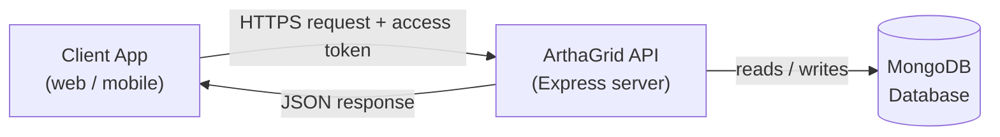
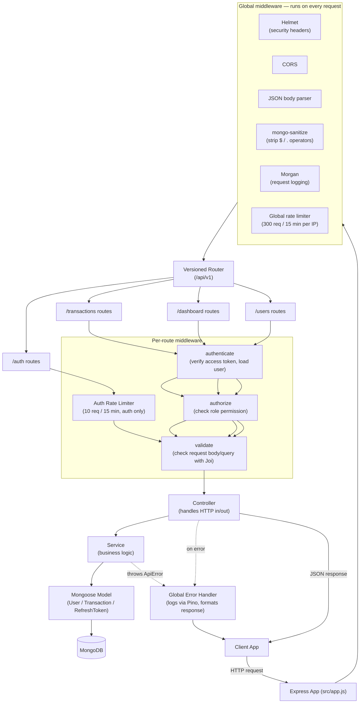
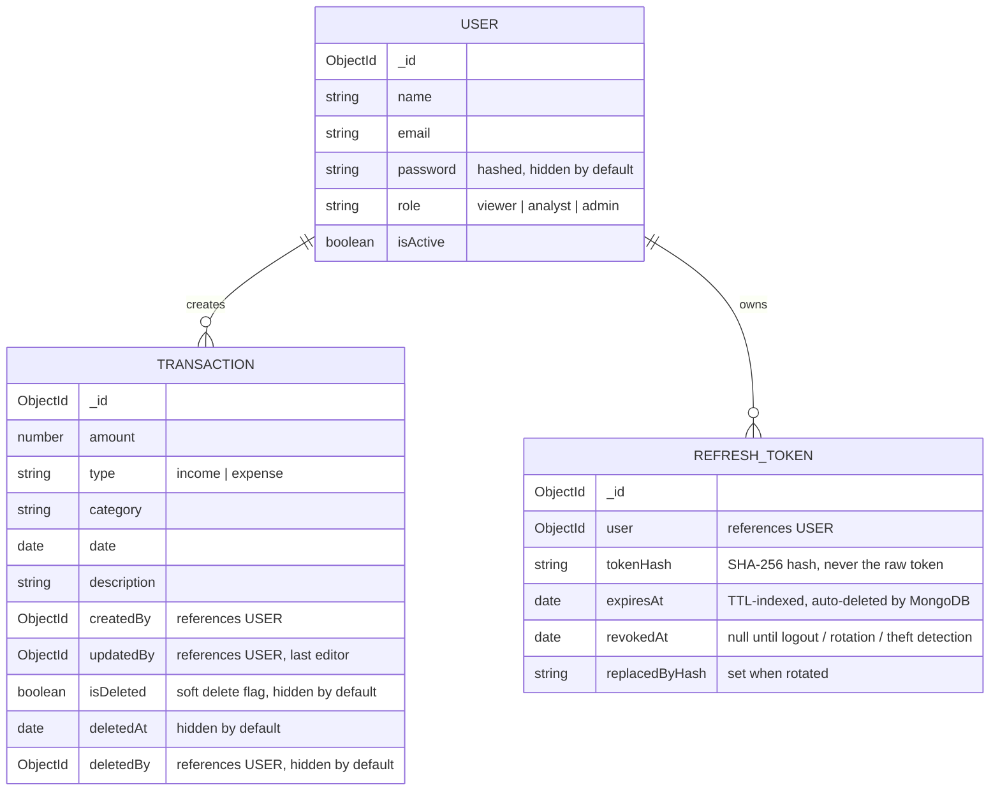
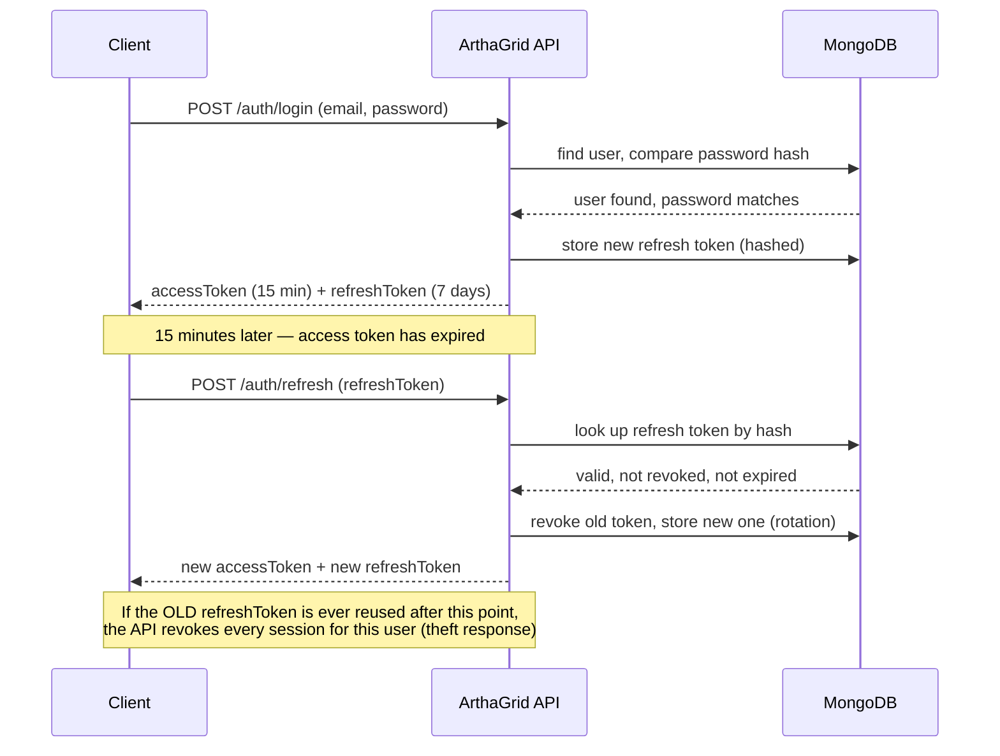
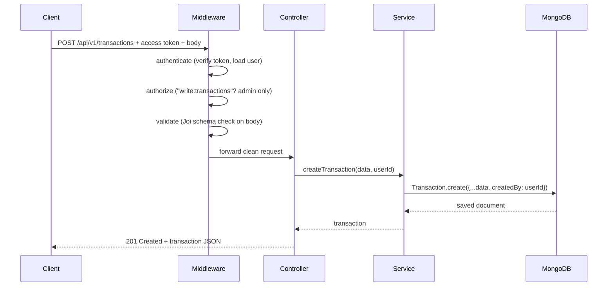

# Architecture

This document explains how ArthaGrid is built, in two levels of detail. Read the "Simple View" if you just want the big picture. Read the "Detailed View" if you're going to work on the code.

## Tech stack

| Piece | Tool | Why (short version — see [decisions.md](./decisions.md) for the full reasoning) |
|---|---|---|
| Language/runtime | Node.js | JavaScript everywhere, huge ecosystem |
| Web framework | Express | Simple, widely known, minimal |
| Database | MongoDB (via Mongoose) | Flexible schema, good fit for evolving financial records |
| Auth | JWT access tokens + DB-backed refresh tokens + bcrypt | Short-lived, revocable login sessions; industry-standard password hashing |
| Validation | Joi | Declarative, readable input validation |
| Security headers | Helmet | Sets safe HTTP headers by default |
| Injection protection | express-mongo-sanitize | Strips MongoDB operators out of user input |
| Cross-origin requests | CORS | Lets a separate frontend call this API |
| Request logging | Morgan (dev) + Pino (app logs) | Human-readable request logs locally; structured, leveled logs everywhere else |
| Rate limiting | express-rate-limit | Slows brute-force login attempts and caps abuse of every route |
| API docs | OpenAPI + Swagger UI | Interactive, browsable documentation at `/api-docs` |
| Containerization | Docker + Docker Compose | Consistent local setup and deployment |

---

## Simple View

At the simplest level, ArthaGrid is a normal client-server API: an app (web or mobile) sends a request, the server checks who is asking and whether they're allowed to do that, then reads or writes data in the database and replies.



**In plain words:** A client sends a request (e.g. "give me my spending summary") along with a short-lived login token. The API checks the token, checks the user's role, does the work, and sends back the answer as JSON. All financial data lives in one MongoDB database. When the login token expires (every 15 minutes by default), the client quietly trades a separate, longer-lived refresh token for a new one instead of asking the user to log in again.

---

## Detailed View

Under the hood, every request passes through a chain of layers. Each layer has one job, which makes the code easier to test and change without breaking other parts.



**In plain words:**

1. **Global middleware** runs on every single request first: Helmet adds safe security headers, CORS allows a frontend on a different domain to call the API, the JSON parser reads the request body, `express-mongo-sanitize` strips out anything that looks like a MongoDB query operator (blocking NoSQL injection attempts), Morgan logs the request for local development, and a baseline rate limiter caps how many requests any one IP can make.
2. **The versioned router** (`/api/v1/...`) sends the request to the right group of routes: `auth`, `transactions`, `dashboard`, or `users`.
3. **Per-route middleware** does checks specific to that route:
   - `authenticate` reads the access token from the `Authorization` header, verifies it, and loads the matching user (rejecting deactivated accounts).
   - `authorize` checks whether that user's role is allowed to do this specific action (e.g. only `admin` can delete a transaction).
   - `validate` checks the incoming data (body or query parameters) against a Joi schema, rejecting anything malformed before it reaches business logic.
4. **The controller** is a thin function that only handles "HTTP in, HTTP out" — it calls the service and shapes the response.
5. **The service** holds the actual business logic (e.g. "build the MongoDB query for filtered transactions," "rotate a refresh token," or "calculate income vs. expenses").
6. **The model** (Mongoose) talks to MongoDB.
7. If anything goes wrong anywhere in this chain, it's thrown as an error, logged internally through the structured logger, and caught by the **global error handler**, which turns it into a consistent JSON error response instead of crashing the server or leaking internal details to the client.

This is a classic **layered (N-tier) architecture**: Routes → Middleware → Controllers → Services → Models → Database. Each layer only knows about the layer directly below it.

---

## Data model



**In plain words:** Every transaction belongs to (was created by) one user, and now also records who last updated or deleted it. Passwords are never returned in normal queries (`select: false`). Deleted transactions aren't actually removed — they're flagged `isDeleted: true` and automatically filtered out of every read. Refresh tokens are stored only as a hash, never the real token value, and expire automatically.

---

## Request flow example: logging in and refreshing a session



---

## Request flow example: creating a transaction



---

## Folder structure

```
ArthaGrid/
├── server.js                 # entry point — validates env, connects DB, starts server, handles shutdown
├── seed.js / clean.js        # dev-only scripts to fill/empty the database
├── Dockerfile / docker-compose.yml   # containerized run (app + local MongoDB)
├── .github/workflows/ci.yml  # runs the test suite on every push/PR
├── docs/                     # this documentation, plus the OpenAPI spec served at /api-docs
├── tests/                    # Jest + Supertest, against an in-memory MongoDB
├── src/
│   ├── app.js                 # Express app setup, global middleware, routes
│   ├── config/
│   │   ├── env.js               # validates process.env at boot, fails fast if misconfigured
│   │   ├── logger.js             # Pino structured logger
│   │   └── db.js                 # MongoDB connection, with retry + graceful event logging
│   ├── routes/v1/              # versioned route definitions (auth, transactions, dashboard, users)
│   ├── controllers/            # thin HTTP handlers
│   ├── services/                # business logic
│   ├── models/                  # Mongoose schemas (User, Transaction, RefreshToken)
│   ├── middleware/              # authenticate, authorize, validate, errorHandler
│   ├── validators/               # Joi schemas (+ shared.js for cross-cutting rules like password strength)
│   └── utils/ApiError.js        # custom error class
```

## API surface (v1)

| Method | Path | Who can call it | Purpose |
|---|---|---|---|
| POST | `/api/v1/auth/register` | anyone | Create an account, receive an access + refresh token |
| POST | `/api/v1/auth/login` | anyone | Log in, receive an access + refresh token |
| POST | `/api/v1/auth/refresh` | anyone with a valid refresh token | Rotate a refresh token for a new access + refresh token pair |
| POST | `/api/v1/auth/logout` | anyone with a refresh token | Revoke a refresh token |
| GET | `/api/v1/transactions` | viewer, analyst, admin | List transactions (filter/sort/paginate) |
| GET | `/api/v1/transactions/:id` | viewer, analyst, admin | Get one transaction |
| POST | `/api/v1/transactions` | admin | Create a transaction |
| PATCH | `/api/v1/transactions/:id` | admin | Update a transaction (records `updatedBy`) |
| DELETE | `/api/v1/transactions/:id` | admin | Soft-delete a transaction (records `deletedBy`/`deletedAt`) |
| GET | `/api/v1/dashboard/summary` | analyst, admin | Totals: income, expenses, net balance |
| GET | `/api/v1/dashboard/by-category` | analyst, admin | Totals grouped by category |
| GET | `/api/v1/dashboard/trends` | analyst, admin | Time-series (weekly/monthly) |
| GET | `/api/v1/dashboard/recent` | analyst, admin | Most recent transactions |
| GET | `/api/v1/dashboard/overview` | analyst, admin | Everything above, in one call |
| GET | `/api/v1/users/me` | any authenticated user | Read your own profile |
| PATCH | `/api/v1/users/me` | any authenticated user | Update your own name/password |
| GET | `/api/v1/users` | admin | List users (paginated, filterable) |
| GET | `/api/v1/users/:id` | admin | Get one user |
| PATCH | `/api/v1/users/:id` | admin | Update a user's name, role, or active status |
| PATCH | `/api/v1/users/:id/deactivate` | admin | Deactivate a user account |
| GET | `/health` | anyone | Basic uptime check |
| GET | `/api-docs` | anyone | Interactive OpenAPI documentation |
