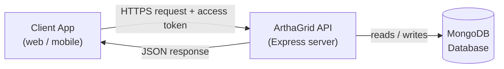
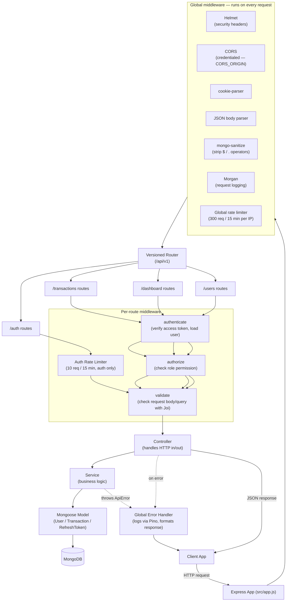
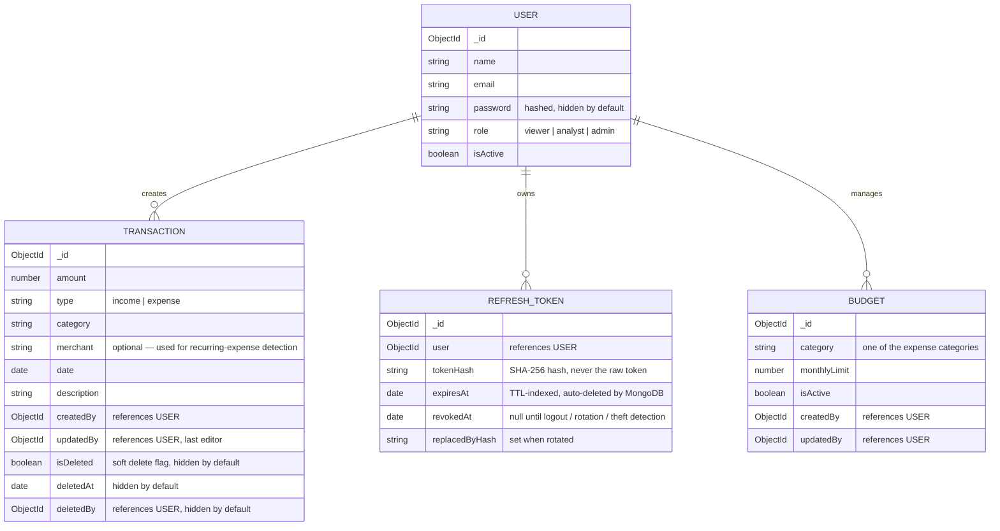
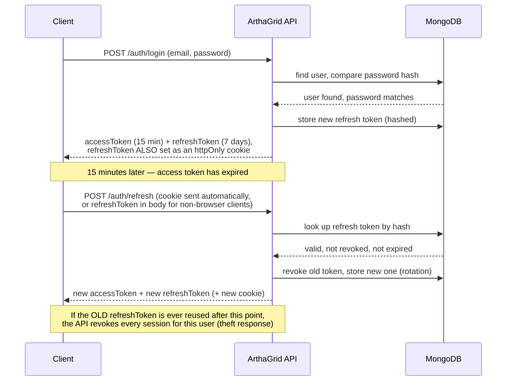
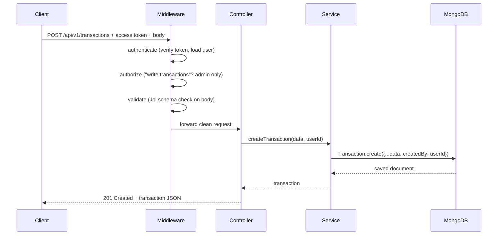
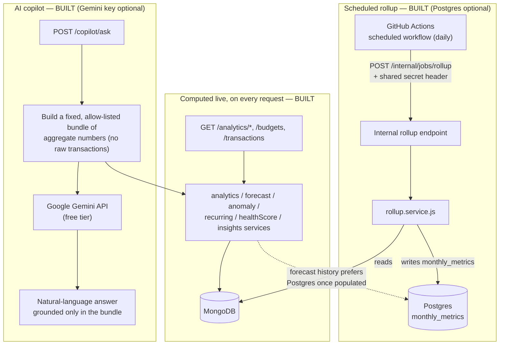
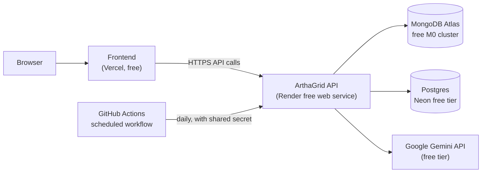

# Architecture

This document explains how ArthaGrid is built, in two levels of detail. Read the "Simple View" if you just want the big picture. Read the "Detailed View" if you're going to work on the code.

## Tech stack

| Piece | Tool | Why (short version — see [decisions.md](./decisions.md) for the full reasoning) |
|---|---|---|
| Language/runtime | Node.js | JavaScript everywhere, huge ecosystem |
| Web framework | Express | Simple, widely known, minimal |
| Database | MongoDB (via Mongoose) | Flexible schema, good fit for evolving financial records |
| Auth | JWT access tokens + DB-backed refresh tokens + bcrypt | Short-lived, revocable login sessions; industry-standard password hashing |
| Validation | Joi | Declarative, readable input validation |
| Security headers | Helmet | Sets safe HTTP headers by default |
| Injection protection | express-mongo-sanitize | Strips MongoDB operators out of user input |
| Cross-origin requests | CORS | Lets a separate frontend call this API |
| Request logging | Morgan (dev) + Pino (app logs) | Human-readable request logs locally; structured, leveled logs everywhere else |
| Rate limiting | express-rate-limit | Slows brute-force login attempts and caps abuse of every route |
| API docs | OpenAPI + Swagger UI | Interactive, browsable documentation at `/api-docs` |
| Containerization | Docker + Docker Compose | Consistent local setup and deployment |
| Analytics store *(optional)* | PostgreSQL (via Neon, `pg` driver, no ORM) | A second, free database holding only one pre-computed rollup table; every endpoint works without it — see [decisions.md](./decisions.md) #17 |
| Scheduled jobs | GitHub Actions scheduled workflow | Stands in for a background worker, which no free hosting tier provides — see [decisions.md](./decisions.md) #18 |
| AI copilot *(optional)* | Google Gemini API (free tier, no SDK — plain `fetch`) | Plain-language Q&A over pre-computed aggregate numbers only — see [decisions.md](./decisions.md) #19 |
| Frontend | React + TypeScript + Vite + Tailwind + hand-authored shadcn-style UI primitives + Recharts + TanStack Query + React Router + Zustand | The first visual dashboard for ArthaGrid (`frontend/`), deployed separately on Vercel |

---

## Simple View

At the simplest level, ArthaGrid is a normal client-server API: an app (web or mobile) sends a request, the server checks who is asking and whether they're allowed to do that, then reads or writes data in the database and replies.



**In plain words:** A client sends a request (e.g. "give me my spending summary") along with a short-lived login token. The API checks the token, checks the user's role, does the work, and sends back the answer as JSON. All financial data lives in one MongoDB database. When the login token expires (every 15 minutes by default), the client quietly trades a separate, longer-lived refresh token for a new one instead of asking the user to log in again.

---

## Detailed View

Under the hood, every request passes through a chain of layers. Each layer has one job, which makes the code easier to test and change without breaking other parts.



**In plain words:**

1. **Global middleware** runs on every single request first: Helmet adds safe security headers, CORS allows the frontend's origin (`CORS_ORIGIN`) to call the API *with credentials* (needed for the refresh-token cookie — see decision #21), `cookie-parser` reads that cookie into `req.cookies`, the JSON parser reads the request body, `express-mongo-sanitize` strips out anything that looks like a MongoDB query operator (blocking NoSQL injection attempts), Morgan logs the request for local development, and a baseline rate limiter caps how many requests any one IP can make.
2. **The versioned router** (`/api/v1/...`) sends the request to the right group of routes: `auth`, `transactions`, `dashboard`, or `users`.
3. **Per-route middleware** does checks specific to that route:
   - `authenticate` reads the access token from the `Authorization` header, verifies it, and loads the matching user (rejecting deactivated accounts).
   - `authorize` checks whether that user's role is allowed to do this specific action (e.g. only `admin` can delete a transaction).
   - `validate` checks the incoming data (body or query parameters) against a Joi schema, rejecting anything malformed before it reaches business logic.
4. **The controller** is a thin function that only handles "HTTP in, HTTP out" — it calls the service and shapes the response.
5. **The service** holds the actual business logic (e.g. "build the MongoDB query for filtered transactions," "rotate a refresh token," or "calculate income vs. expenses").
6. **The model** (Mongoose) talks to MongoDB.
7. If anything goes wrong anywhere in this chain, it's thrown as an error, logged internally through the structured logger, and caught by the **global error handler**, which turns it into a consistent JSON error response instead of crashing the server or leaking internal details to the client.

This is a classic **layered (N-tier) architecture**: Routes → Middleware → Controllers → Services → Models → Database. Each layer only knows about the layer directly below it.

---

## Data model



**In plain words:** Every transaction belongs to (was created by) one user, and now also records who last updated or deleted it. Passwords are never returned in normal queries (`select: false`). Deleted transactions aren't actually removed — they're flagged `isDeleted: true` and automatically filtered out of every read. Refresh tokens are stored only as a hash, never the real token value, and expire automatically. `merchant` is optional and mainly powers recurring-expense detection — older transactions simply don't have one. Budgets are shared across the whole ledger (not per-user), matching how transactions already work — anyone can view budget progress, only an admin can set the limits.

Alongside MongoDB, a single **derived, rebuildable** table (`monthly_metrics`) can live in a separate free Postgres database — see the **Analytics pipeline** section below. It's not a source of truth; it's a cache-shaped copy of numbers MongoDB could always recompute, and it's entirely optional: without `POSTGRES_URL` configured, every analytics endpoint just computes its answer live from MongoDB instead, exactly as before this table existed. (The original design sketched five rollup tables — `daily_metrics`, `category_metrics`, `recurring_expenses`, and `forecast_snapshots` alongside `monthly_metrics` — but only `monthly_metrics` actually has a consumer today, the forecast endpoint's history. The others were cut before being built rather than shipping write-only tables nobody reads; they can come back if a concrete endpoint needs them.)

---

## Request flow example: logging in and refreshing a session



---

## Request flow example: creating a transaction



---

## Analytics pipeline and AI copilot (ArthaGrid 2.0)

Every part of this diagram is **built and live** — see [upgrades.md](./upgrades.md) for the full list.

The analytics/budgets/insights features live as new modules inside the same Express service — there is no separate "Analytics Service" or "ML Service" process (see [decisions.md](./decisions.md) #20). Two things sit outside the normal request/response flow: the Postgres rollup job, triggered on a schedule rather than by a client request, and the AI copilot's call out to Gemini, triggered by a client request but talking to a third party instead of a database.



**In plain words:**
- **Built:** every analytics/budgets/insights endpoint computes its answer live from MongoDB on every request, the same way `dashboard.service.js` already did — this is simple and fast enough at this data scale, and needs no extra infrastructure.
- **Built, optional:** a separate, scheduled path exists for the one number that's worth pre-computing — monthly income/expense/net totals, which the forecast endpoint reads repeatedly. Once a day, a GitHub Actions workflow calls a protected internal endpoint that reads from MongoDB and rebuilds `monthly_metrics` in Postgres. Nothing in this path runs continuously — it's an on/off script triggered by a timer, not a background worker. Without `POSTGRES_URL` set, this path simply never activates and the forecast endpoint keeps computing its history live from MongoDB, exactly as it did before this existed.
- **Built, optional:** the AI copilot never touches MongoDB or Postgres directly from Gemini's side. The server first computes a small, explicitly allow-listed bundle of aggregate numbers using the same analytics services as everything else, and only that bundle (plus the user's question) is sent to Gemini — verified by a test that mocks the call and inspects the exact request body. Without `GEMINI_API_KEY` set, `POST /copilot/ask` returns `503` instead of the server failing to start.

---

## Folder structure

```
ArthaGrid/
├── server.js                 # entry point — validates env, connects DB, starts server, handles shutdown
├── seed.js / clean.js        # dev-only scripts to fill/empty the database
├── Dockerfile / docker-compose.yml   # containerized run (app + local MongoDB)
├── .github/workflows/
│   ├── ci.yml                   # runs the test suite on every push/PR
│   └── rollup.yml                # scheduled workflow — calls the internal rollup endpoint daily
├── docs/                     # this documentation, plus the OpenAPI spec served at /api-docs
├── frontend/                 # React dashboard — separate app, own package.json, deployed to Vercel
│   └── src/
│       ├── api/                  # TanStack Query hooks, one file per backend resource
│       ├── components/ui/         # hand-authored shadcn-style primitives (button, card, table, …)
│       ├── components/layout/     # Sidebar, Topbar, AppLayout, ProtectedRoute
│       ├── pages/                # one folder per route (overview, analytics, budgets, forecast,
│       │                          #   insights, copilot, transactions, settings, auth)
│       ├── store/authStore.ts     # Zustand — user + in-memory access token only, nothing persisted
│       └── lib/api.ts             # fetch wrapper: attaches the access token, retries once via
│                                   #   silent refresh on a 401, matches decisions.md #21
├── tests/                    # Jest + Supertest, against an in-memory MongoDB
├── src/
│   ├── app.js                 # Express app setup, global middleware, routes
│   ├── config/
│   │   ├── env.js               # validates process.env at boot, fails fast if misconfigured
│   │   ├── logger.js             # Pino structured logger
│   │   ├── db.js                 # MongoDB connection, with retry + graceful event logging
│   │   └── postgres.js            # optional Postgres connection pool for the analytics rollup store
│   ├── db/schema.sql           # Postgres rollup table definition (monthly_metrics)
│   ├── routes/v1/              # auth, transactions, dashboard, users, budgets, analytics, copilot, internal
│   ├── controllers/            # thin HTTP handlers
│   ├── services/                # business logic, incl. analytics/forecast/anomaly/recurring/
│   │                            #   healthScore/insights/budget/rollup/copilot services
│   ├── models/                  # Mongoose schemas (User, Transaction, RefreshToken, Budget)
│   ├── middleware/              # authenticate, authorize, validate, errorHandler,
│   │                            #   verifyCronSecret, extractRefreshToken
│   ├── validators/               # Joi schemas (+ shared.js for cross-cutting rules like password strength)
│   └── utils/
│       ├── ApiError.js            # custom error class
│       ├── stats.js               # mean/stddev/linear-regression helpers used by forecasting & anomaly detection
│       └── cookies.js             # sets/clears the httpOnly refresh-token cookie
```

## API surface (v1)

This table is the actual, live API — it matches [openapi.yaml](./openapi.yaml), which is the source of truth (browsable at `/api-docs`). If the two ever disagree, `openapi.yaml` is right and this table is stale.

| Method | Path | Who can call it | Purpose |
|---|---|---|---|
| POST | `/api/v1/auth/register` | anyone | Create an account, receive an access + refresh token (refresh token also set as an httpOnly cookie) |
| POST | `/api/v1/auth/login` | anyone | Log in, receive an access + refresh token (refresh token also set as an httpOnly cookie) |
| POST | `/api/v1/auth/refresh` | anyone with a valid refresh token (cookie or body) | Rotate a refresh token for a new access + refresh token pair |
| POST | `/api/v1/auth/logout` | anyone with a refresh token (cookie or body) | Revoke a refresh token, clear the cookie |
| GET | `/api/v1/transactions` | viewer, analyst, admin | List transactions (filter/sort/paginate) |
| GET | `/api/v1/transactions/:id` | viewer, analyst, admin | Get one transaction |
| POST | `/api/v1/transactions` | admin | Create a transaction — response includes a non-blocking `unusual: { flagged, score }` anomaly hint |
| PATCH | `/api/v1/transactions/:id` | admin | Update a transaction (records `updatedBy`) |
| DELETE | `/api/v1/transactions/:id` | admin | Soft-delete a transaction (records `deletedBy`/`deletedAt`) |
| GET | `/api/v1/dashboard/summary` | analyst, admin | Totals: income, expenses, net balance |
| GET | `/api/v1/dashboard/by-category` | analyst, admin | Totals grouped by category |
| GET | `/api/v1/dashboard/trends` | analyst, admin | Time-series (weekly/monthly) |
| GET | `/api/v1/dashboard/recent` | analyst, admin | Most recent transactions |
| GET | `/api/v1/dashboard/overview` | analyst, admin | Everything above, in one call |
| GET | `/api/v1/users/me` | any authenticated user | Read your own profile |
| PATCH | `/api/v1/users/me` | any authenticated user | Update your own name/password |
| GET | `/api/v1/users` | admin | List users (paginated, filterable) |
| GET | `/api/v1/users/:id` | admin | Get one user |
| PATCH | `/api/v1/users/:id` | admin | Update a user's name, role, or active status |
| PATCH | `/api/v1/users/:id/deactivate` | admin | Deactivate a user account |
| GET | `/api/v1/budgets` | viewer, analyst, admin | List budgets with current-month progress |
| POST | `/api/v1/budgets` | admin | Create a monthly budget for a category |
| PATCH | `/api/v1/budgets/:id` | admin | Update a budget's limit or active status |
| DELETE | `/api/v1/budgets/:id` | admin | Remove a budget |
| GET | `/api/v1/analytics/metrics` | analyst, admin | Expanded financial/behavioral/comparative metrics |
| GET | `/api/v1/analytics/forecast` | analyst, admin | Moving-average / linear-regression spending forecast |
| GET | `/api/v1/analytics/anomalies` | analyst, admin | Statistically unusual transactions (leave-one-out z-score) |
| GET | `/api/v1/analytics/recurring` | analyst, admin | Detected recurring expenses (subscriptions, rent, etc.) |
| GET | `/api/v1/analytics/health-score` | analyst, admin | Financial Health Score, with its component breakdown |
| GET | `/api/v1/analytics/insights` | analyst, admin | Rule-based plain-language insights |
| POST | `/api/v1/copilot/ask` | analyst, admin | Ask a plain-language question, answered from aggregate data via Gemini — 20 requests/hour |
| GET | `/health` | anyone | Basic uptime check |
| GET | `/api-docs` | anyone | Interactive OpenAPI documentation |

### Internal, built but deliberately not public

| Method | Path | Who can call it | Purpose |
|---|---|---|---|
| POST | `/api/v1/internal/jobs/rollup` | internal only — a static `X-Cron-Secret` header, not a user session | Rebuilds `monthly_metrics` in Postgres from MongoDB. Called by the scheduled GitHub Actions workflow (`.github/workflows/rollup.yml`). Live and tested, but never listed in `openapi.yaml`/`/api-docs` — it's not something an API consumer should ever call. |

Every endpoint from the original ArthaGrid 2.0 plan is now built — see [upgrades.md](./upgrades.md) for the full Stage A–D history, and the "Roadmap" section there for what's deliberately still open beyond this round.

---

## Deployment (free tier)

ArthaGrid is **designed** to run entirely on free tiers, spread across five services — and as of Stage D, all five are code-ready: MongoDB Atlas, Neon Postgres, Render, the GitHub Actions rollup job, the Gemini-based copilot, and now the `frontend/` app for Vercel. The connection logic, schema, workflow file, copilot endpoint, and frontend all exist and are tested — actually running on all five still means creating those free accounts and setting the matching environment variables, which is what [deployment.md](./deployment.md) walks through step by step. Here's the shape of the deployment:



Each piece is free on its own, but each also comes with a free-tier limitation worth knowing about rather than being surprised by:

| Service | Free-tier limitation | What it means in practice |
|---|---|---|
| Render (API hosting) | Sleeps after 15 minutes idle, ~1 minute cold start | The first request after a quiet period (e.g. first thing in the morning) will be slow. Nothing to fix for free — just expected. |
| MongoDB Atlas M0 | 512MB storage, ~100 operations/second, auto-pauses after 30 days with zero connections | Fine at personal/small-team scale. The daily rollup job also happens to keep it from ever going fully idle. |
| Neon Postgres | 0.5GB storage, 100 compute-hours/month, scales to zero | Only ever holds small, pre-aggregated rollup tables, so the storage limit isn't a real constraint. |
| GitHub Actions | 2,000 free minutes/month on a private repo (unlimited on a public repo) | The rollup job runs once a day and takes seconds — nowhere near the limit. |
| Google Gemini API | Free tier is Flash-model-only, rate-limited, and inputs may be used to improve Google's products | Mitigated by only ever sending pre-computed aggregate numbers to it, never raw transactions (see [decisions.md](./decisions.md) #19). |
| Vercel (frontend hosting) | Hobby plan is personal/non-commercial use only | Fine for a portfolio project; would need a paid plan if this were ever monetized. |
