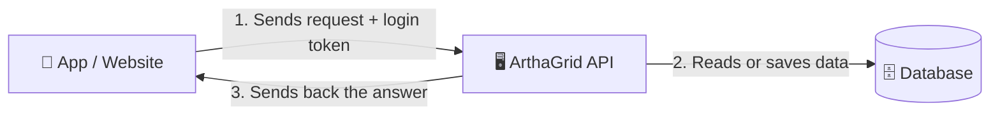
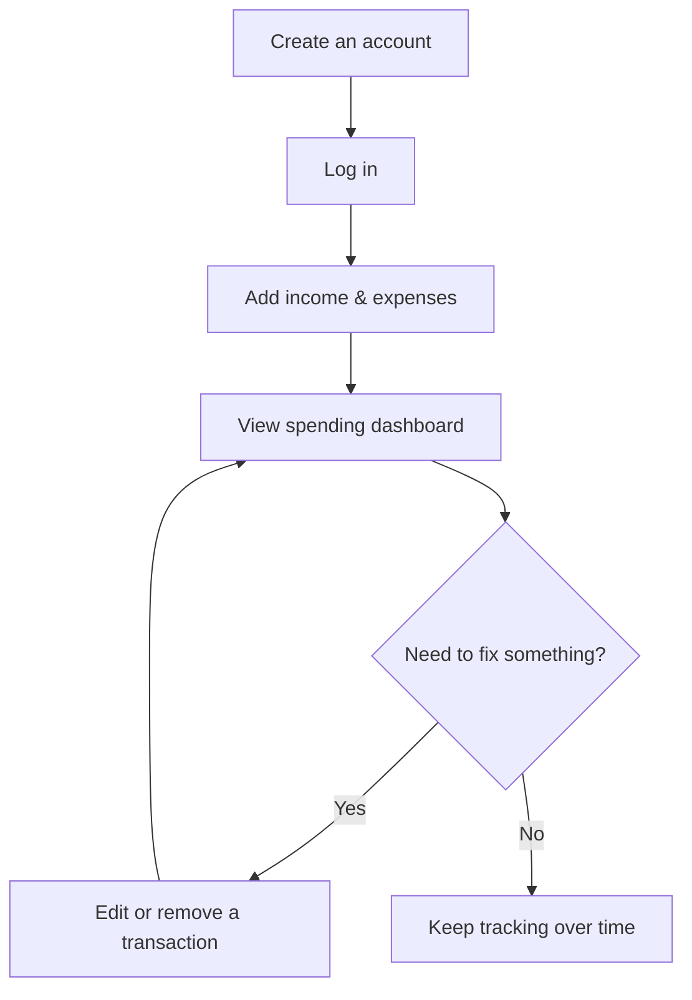

# ArthaGrid — Project Report

*A simple walkthrough of what this project is, how it works, and what it can do.*

---

## Quick Facts

| | |
|---|---|
| **What it is** | A personal-finance analytics platform — tracks income/expenses, analyzes/budgets/forecasts them, answers plain-language questions about your money, and has a real dashboard to look at all of it |
| **Built with** | Node.js/Express/MongoDB backend, an optional Postgres for fast analytics history, an optional AI assistant (Google Gemini), and a React frontend |
| **Who it's for** | Anyone needing to track money — one person or a small team |
| **Type** | A REST API plus a React dashboard on top of it |
| **Status** | Working backend and frontend, security-hardened, tested, documented, containerized, and designed to run entirely on free hosting |

---

## 1. What is ArthaGrid?

ArthaGrid is a finance-tracking app with two halves: a server (the API, in `src/`) that stores data safely and does the actual work, and a dashboard (in `frontend/`) that's what you actually look at and click around in. Between the two, it answers questions like:

- "Add this expense."
- "Show me everything I spent last month."
- "How much did I save this year?"
- "Am I about to go over my Travel budget?"
- "Is this transaction unusually large for this category?"
- "Why did my expenses increase this month?" (answered in plain English by an AI assistant)

The API is also a normal REST API on its own — any other website or mobile app could call it directly instead of using ArthaGrid's own dashboard.

The name comes from **"Artha"** (Sanskrit for wealth) and **"Grid"** (a structured system) — a structured system for managing money.

---

## 2. Who Uses It

The system supports three types of users, so it works for a single person or a small team:

| Role | Can do |
|---|---|
| 👀 **Viewer** | See transactions and reports, manage their own account |
| 📊 **Analyst** | Everything a Viewer can, plus see deeper analytics |
| 🛠️ **Admin** | Everything above, plus add/edit/remove transactions and manage other users |

---

## 3. How It Works (The Big Picture)

At its simplest, this is how every request flows through the system:

**In plain words:** An app sends a request (like "give me my spending summary") along with proof of who's asking (a login token). The server checks that the person is allowed to see this, fetches or updates the data in the database, and sends the answer back as a simple response.

> 📸 **[Add screenshot here — Server running]**
> **What to capture:** The terminal window showing the server has started successfully.
> **How to get it:**
> 1. Open a terminal in the project folder.
> 2. Run `npm run dev`.
> 3. Wait for the message that says the server is running (e.g. "Server running on port 5000").
> 4. Take a screenshot of that terminal window.
> 5. Save it as `docs/screenshots/server-startup.png` and replace this block with:
>    ``

---

## 4. A Day in the Life (How Someone Would Actually Use It)

1. **Create an account** — sign up with a name, email, and password.
2. **Log in** — get a "pass" (a token) proving who you are, without needing to type your password again on every request.
3. **Add transactions** — record money coming in (salary, freelance work) or going out (rent, groceries, bills).
4. **View the dashboard** — see totals, spending by category, and trends over time, calculated automatically.
5. **Edit or fix mistakes** — update or remove a transaction if something was entered wrong. Nothing is ever truly erased — a record is kept of what changed and who changed it, which matters for anything involving money.

> 📸 **[Add screenshot here — The dashboard's Overview page]**
> **What to capture:** The actual dashboard, not the raw API — the stat cards, spending chart, and recent transactions.
> **How to get it:**
> 1. Run the backend (`npm run dev`) and, in a second terminal, the frontend (`cd frontend && npm run dev`).
> 2. Open `http://localhost:5173`, log in, and land on the Overview page.
> 3. Take a screenshot of the page.
> 4. Save it as `docs/screenshots/dashboard-overview.png` and replace this block with:
>    ``

---

## 5. What You Can Do With It (Endpoints)

An "endpoint" is just a specific thing you can ask the API to do. Here's the full list, grouped by purpose, in plain language:

### Account & Login

| Action | Who can do it |
|---|---|
| Create an account | Anyone |
| Log in | Anyone with an account |
| Stay logged in without re-entering a password | Anyone with a valid session |
| Log out | Anyone logged in |

The dashboard handles all of this automatically — its "stay logged in" step happens invisibly, via a cookie the browser manages on its own.

### Transactions (Income & Expenses)

| Action | Who can do it |
|---|---|
| View all transactions (with filters, search, sorting) | Viewer, Analyst, Admin |
| View one transaction | Viewer, Analyst, Admin |
| Add a new transaction | Admin |
| Edit a transaction | Admin |
| Remove a transaction | Admin |

### Dashboard & Reports

| Action | Who can do it |
|---|---|
| See totals (income, expenses, net balance) | Analyst, Admin |
| See spending broken down by category | Analyst, Admin |
| See trends over time (weekly/monthly) | Analyst, Admin |
| See the most recent activity | Analyst, Admin |
| See everything above in one combined report | Analyst, Admin |

### User Management

| Action | Who can do it |
|---|---|
| View/update your own profile | Anyone logged in |
| View all users | Admin |
| Change a user's role or turn their account off | Admin |

### Budgets

| Action | Who can do it |
|---|---|
| See budgets and how much of each is spent this month | Viewer, Analyst, Admin |
| Create or change a budget | Admin |

### Analytics & Insights

| Action | Who can do it |
|---|---|
| See deeper spending metrics (burn rate, weekday vs. weekend, category growth, etc.) | Analyst, Admin |
| See a spending forecast for next month | Analyst, Admin |
| See flagged unusual transactions | Analyst, Admin |
| See detected recurring expenses (subscriptions, rent, etc.) | Analyst, Admin |
| See the Financial Health Score | Analyst, Admin |
| See plain-language insights ArthaGrid noticed on its own | Analyst, Admin |
| Ask a question in plain language ("why did my spending increase?") and get an AI-written answer | Analyst, Admin |

> 📸 **[Add screenshot here — Full list of endpoints]**
> **What to capture:** The interactive API documentation page, showing every endpoint in one place.
> **How to get it:**
> 1. Make sure the server is running (`npm run dev`).
> 2. Open your browser to `http://localhost:5000/api-docs`.
> 3. Take a screenshot of the page.
> 4. Save it as `docs/screenshots/api-docs.png` and replace this block with:
>    ``

> 📸 **[Add screenshot here — A real request and response]**
> **What to capture:** What it looks like to actually use the API and get real data back.
> **How to get it:**
> 1. On the `/api-docs` page, open **POST /auth/login**, click **"Try it out"**, enter a test email/password, and click **Execute**.
> 2. Screenshot the response showing the returned tokens.
> 3. Save it as `docs/screenshots/login-response.png` and replace this block with:
>    ``

> 📸 **[Add screenshot here — Dashboard numbers]**
> **What to capture:** A real example of the automatic spending summary.
> **How to get it:**
> 1. On `/api-docs`, open **GET /dashboard/summary**, click the padlock icon and paste in the access token you got from logging in.
> 2. Click **"Try it out" → Execute**.
> 3. Screenshot the JSON response showing totals like income, expenses, and net balance.
> 4. Save it as `docs/screenshots/dashboard-summary.png` and replace this block with:
>    ``

---

## 6. Important Decisions (and Why They Were Made)

A few choices shape how this project behaves. Here's each one in plain language:

- **MongoDB as the database** — because financial records (a transaction, a user) are simple, self-contained pieces of information that don't need complicated cross-references, and MongoDB makes it easy to grow the system later.

- **Two kinds of login tokens, not one** — instead of one long-lasting "pass" that can't be taken back once handed out, the system uses a short-lived pass (15 minutes) plus a longer-lasting one used only to quietly renew it. If a pass is ever stolen, it naturally stops working fast — and if someone tries to reuse an old, already-replaced pass, the system treats it as a red flag and shuts down every active session for that account.

- **Roles instead of per-person permissions** — rather than deciding permissions person-by-person, everyone is put into one of three roles (Viewer, Analyst, Admin) with a fixed set of things they can do. This is simple to explain and simple to check.

- **Nothing is ever truly deleted** — "deleting" a transaction just hides it and records who removed it and when. This matters for money: you should always be able to explain how a number came to be, even after something was changed or removed.

- **Calculations happen inside the database** — reports (like "total spent this month") are calculated by the database itself rather than by pulling all the data out and doing math in the code. This is much faster as the amount of data grows.

- **Fail loudly, not quietly** — if something important is missing when the server starts (like a security key), it refuses to start at all with a clear error, instead of running in a broken or insecure state.

- **Every "smart" number comes with a plain-English formula, not a black box** — the Financial Health Score, the spending forecast, and "this looks unusual" flags are all built from simple, published math (averages, trend lines, how far a number is from the normal range) instead of a machine-learning model nobody can explain. You can always see *why* ArthaGrid says what it says.

- **An unusual transaction is flagged, never blocked** — if you record an unusually large expense, ArthaGrid tells you so, but it still saves it. The system's job is to notice things, not to get in the way of you recording what actually happened.

- **A second, small database (Postgres) just for pre-calculated numbers — optional** — MongoDB stays the one true copy of every transaction. If you connect a (free) Postgres database, it holds one ready-made summary table ("total spent per month") rebuilt automatically once a day, so the spending forecast stays fast without recalculating everything from scratch on every click. Don't connect one, and forecasting just calculates it live from MongoDB instead — nothing breaks either way.

- **No "always-on" background robot** — a lot of finance apps use a constantly-running background worker to do heavy calculations. That kind of always-on process isn't free to host, so instead a scheduled job (using GitHub's free automation tool) simply asks the API to refresh its numbers once a day. Same result, no ongoing cost.

- **The AI assistant only ever sees summary numbers, never your actual transactions — and that's checked automatically, not just promised** — when you ask it a question, ArthaGrid first calculates a small set of relevant numbers itself, and only sends those numbers (never a transaction's description or merchant name) to the AI service that writes the answer in plain English. An automated test double-checks this by looking at exactly what would be sent, so this isn't just something the documentation claims.

- **The AI assistant is optional, like Postgres** — if you don't set up a (free) Google Gemini API key, asking it a question returns a clear "not available" response instead of the server breaking.

- **The dashboard never has to remember your login token itself** — instead, the server hands it a special cookie that JavaScript literally can't read, and the browser quietly attaches it whenever it needs to prove who you are. This was actually corrected mid-build: the original plan used a cookie setting (`SameSite=Strict`) that would have completely broken once the dashboard and the server ended up on two different websites (which they do, on free hosting) — so it was fixed to a setting that works across sites, plus one extra safety check to make up for the protection that setting change gave up. That kind of "caught it while building, wrote down why" moment is exactly what [decisions.md](./decisions.md) is for.

*(For the full reasoning behind every decision, including trade-offs, see [decisions.md](./decisions.md).)*

---

## 7. Built to Be Production-Ready

Beyond "it works," the project has been hardened the way a real, launched product would need to be:

- ✅ **Tested** — an automated test suite checks that logins, permissions, transactions, and reports all behave correctly, and catches mistakes before they reach real users.
- ✅ **Secure by default** — passwords are never stored in plain text or shown in logs, common attack patterns (like malicious database queries) are blocked automatically, and repeated login attempts are slowed down to prevent guessing attacks.
- ✅ **Traceable** — every important action on a financial record (created, changed, removed) records who did it.
- ✅ **Observable** — the server produces clean, structured logs instead of scattered debug text, making it realistic to monitor once it's running somewhere other than a developer's laptop.
- ✅ **Documented** — every endpoint is described in an interactive page (`/api-docs`) that anyone can open and try out.
- ✅ **Portable** — the whole system (server + database) can be started with a single command using Docker, so it runs the same way on any machine.
- ✅ **Continuously checked** — every change is automatically tested before it's allowed to be merged, using GitHub Actions.
- ✅ **Analytics you can trust** — the forecast, the anomaly flags, and the Financial Health Score are all built on simple, published formulas, each backed by an automated test that checks the math against known numbers.
- ✅ **Free-tier-ready today** — the API, the dashboard, MongoDB, the optional Postgres analytics store, the scheduled rollup job, and the AI assistant are all built and tested against free-tier hosting (Render, Vercel, Atlas, Neon, GitHub Actions, Google Gemini); actually deploying them just means creating those free accounts — see [deployment.md](./deployment.md) for the step-by-step walkthrough.

---

## 8. What's Next

The originally planned feature set (analytics, budgets, forecasting, the AI assistant, and the dashboard) is now fully built. A few things are still intentionally left for later — not forgotten, just not needed yet:

- A full history of every change to a record (right now it remembers the *latest* change, not every past one).
- The ability to create custom roles beyond Viewer/Analyst/Admin.
- Extra safeguards a bank or finance company would eventually want, like requiring a second login step for admins, or storing money amounts in a way that avoids tiny rounding errors at large scale.
- Teaching ArthaGrid to guess a transaction's category automatically from a short description (it needs enough of your own real history first to learn from).
- Automatic weekly email reports, and a separate dashboard for administrators to see system-wide usage.

The full, detailed list — with reasons for each — is in [upgrades.md](./upgrades.md).

---

## 9. Where to Learn More

This report is meant to be a quick, friendly overview. For more depth:

| Document | What's in it |
|---|---|
| [context.md](./context.md) | The bigger picture — what the project is for and its current state |
| [architecture.md](./architecture.md) | A deeper technical look at how the system is built, with detailed diagrams |
| [decisions.md](./decisions.md) | The full reasoning and trade-offs behind every major technical choice |
| [upgrades.md](./upgrades.md) | Everything that's been improved, and what's planned next |
| [deployment.md](./deployment.md) | Step-by-step guide to putting ArthaGrid online for free |
